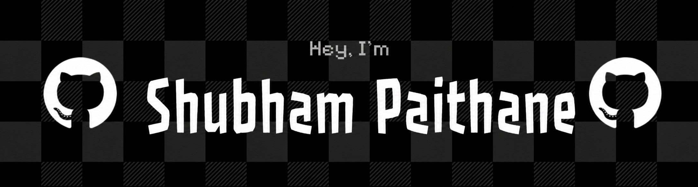

 

 

 

## 🚀 About Me

- 🎓 Computer Science student, passionate about building **full stack** & **AI-powered** applications
- 🛠️ Most of my work lives on my [GitHub Repositories](https://github.com/ShubhamPaithane04?tab=repositories)
- 🌐 Check out my work and projects on my **[Portfolio Website](https://my-portfolio-oerl.vercel.app/)**
- 📫 Reach me anytime at **shubhampaithane04@gmail.com**
- ⚡ Currently exploring LLMs, agentic AI, and scalable backend systems

 

## 🔭 Featured Projects

<table>
<tr>
<td width="50%" valign="top">

### 🌟 [Aizen](https://github.com/ShubhamPaithane04/Agentic-AI)
Browser-based AI coding assistant — describe what you want to build, and it classifies your intent, scaffolds a real project across ~10 tech stacks, then runs an agent loop (read → edit → validate) until the result actually works, with a deterministic fallback if the LLM call fails.

   

</td>
<td width="50%" valign="top">

### 🧾 [Trust_Ledger](https://github.com/ShubhamPaithane04/Trust_Ledger)
🚧 In active development — check the repo for the latest details.

</td>
</tr>
</table>

 

## 💻 Tech Stack

### 🚀 Languages
     

### 🖼️ Frameworks
    

### 🗄️ Databases
  

### 🤖 AI / APIs
   

### ☁️ Cloud & Tools
     

 

## 📊 GitHub Stats

  
  

  

  

 

## 🏆 GitHub Trophies

  

 

## 🌐 Connect with me

  
  
  

  

  

